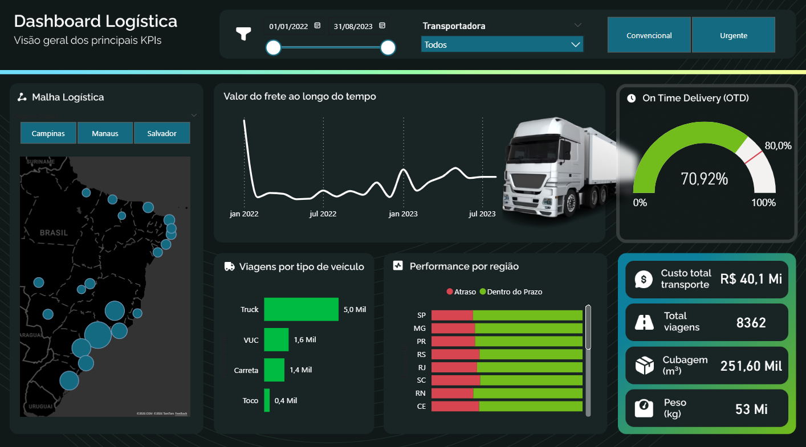

# 🚚 Logistics Performance Dashboard

## 📊 Visão Geral do Projeto
Este projeto consiste em um dashboard estratégico de logística desenvolvido no **Power BI**, focado no monitoramento de eficiência de entregas e custos de transporte. 

O objetivo principal desta solução é fornecer uma visão 360º da operação logística, permitindo que gestores identifiquem gargalos regionais, controlem o orçamento de frete e monitorem a qualidade do serviço através do indicador OTD (On Time Delivery).

## 🎯 Problema de Negócio e Solução
A gestão logística enfrentava desafios para visualizar de forma consolidada o desempenho das transportadoras e o custo total por região. Este painel soluciona o problema centralizando dados críticos para responder a perguntas como:
* Qual é o custo total de transporte acumulado no período?
* O nível de serviço (OTD) está dentro da meta estabelecida?
* Quais regiões apresentam maior índice de atrasos?
* Qual é a representatividade de cada tipo de veículo na malha logística?

## 📈 Principais KPIs e Métricas
O dashboard monitora indicadores fundamentais para a cadeia de suprimentos:

* **OTD (On Time Delivery):** Indicador de pontualidade (Visualizado: 70.92%).
* **Custo Total de Transporte:** Monitoramento financeiro (Visualizado: R$ 40,1 Mi).
* **Volume de Viagens:** Total de 8.362 viagens no período.
* **Cubagem e Peso:** Métricas de capacidade e carga (251,60 Mil m³ e 53 Mi kg).
* **Performance por Região:** Comparativo de entregas "No Prazo" vs. "Atraso" por estado.

## 🛠️ Ferramentas e Tecnologias Utilizadas
* **Power BI:** Construção do dashboard e interatividade.
* **Power Query (ETL):** Limpeza e transformação dos dados.
* **DAX:** Criação de medidas calculadas para OTD, acumalados e médias.
* **Figma/Adobe:** Prototipagem do background e layout (UI/UX Design).
* **Excel/CSV:** Fonte de dados.

## 🧠 Funcionalidades
* **Navegação Temporal:** Filtros de data para análise histórica (Jan 2022 - Jul 2023).
* **Filtros Dinâmicos:** Segmentação por Transportadora e Tipo de Envio (Convencional/Urgente).
* **Visualização Geográfica:** Mapa de calor da malha logística por cidade de origem.
* **Tooltips Personalizados:** Detalhamento ao passar o mouse sobre os gráficos.

## 🚀 Como Executar o Projeto
1. Clone este repositório.
2. Abra o arquivo `.pbix` no Microsoft Power BI Desktop.
3. A base de dados fictícia está anexa na pasta `dados` (se aplicável).

---
*Desenvolvido por [Caroline Mann Wharton Luzio](https://www.linkedin.com/in/caroline-mann-wharton-luzio/)*
